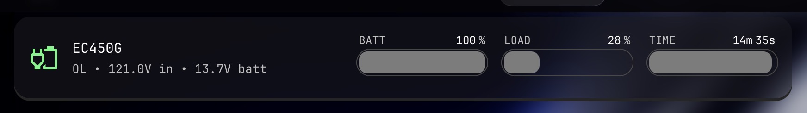

# Glance-NUT

Small NUT-to-HTTP bridge for Glance, plus a matching `custom-api` widget.



## Structure

- `nutbridge/`: tiny containerized bridge that reads NUT with `upsc`
- `ups.yml`: Glance widget config

## Bridge setup

1. Edit the placeholder values in `nutbridge/docker-compose.yml`.
2. Start the bridge:

```bash
cd nutbridge
docker compose up -d --build
```

3. Test it:

```bash
curl http://127.0.0.1:3494/ups
```

## Glance setup

Edit the placeholder URL in `ups.yml`, then include it in your Glance page config.

If you prefer env-based configuration, the files are still simple to adapt.

*Disclaimer: this is fully vibe-coded by Codex 5.4. However, the code is simple and straightforward, so AI seems fine here. If you have any concerns, feel free to contact me, I am a real human :)*
